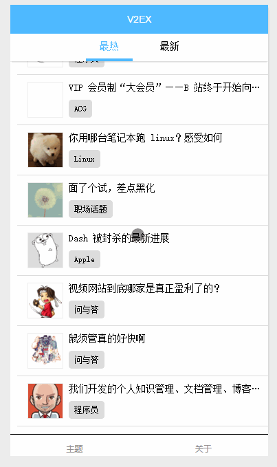

# 微信小程序demo - v2ex

## 截图



## 目录结构
```
├── app.js
├── app.json
├── app.wxss
├── pages
│   ├── index
│   ├── detail
│   ├── about
│   └── logs
├── static
│   └── static
│ 		└──logo.png
└── utils
    └── util.js
```

## v2ex api
[https://www.v2ex.com/p/7v9TEc53](https://www.v2ex.com/p/7v9TEc53)

## 小程序官方文档

[文档](https://mp.weixin.qq.com/debug/wxadoc/dev/?t=1475052055990)

